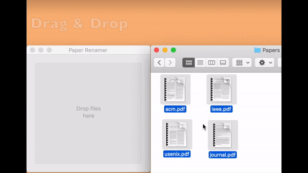

# Paper Renamer

> **⚠️ Important Notice:** This repository is no longer actively maintained. Please use [AI Paper Renamer](https://github.com/huwan/ai-paper-renamer) instead!
>
> **AI Paper Renamer** automatically renames academic PDF files using AI-extracted titles with a single keyboard shortcut. It provides a more modern and efficient approach to renaming your academic papers.

Easily rename your academic paper file to more readable name using the title of the paper.

## Paper Renamer for MacOS

Paper Renamer is a dedicated MacOS application that transforms the [pdftitle](https://github.com/huwan/pdftitle) Python script into a native MacOS app using [Platypus](https://sveinbjorn.org/platypus). It packages the script into a MacOS application bundle, complete with an executable that runs the script.

### Installation

**Available packages**

- Download the latest DMG file from the releases page [here](https://github.com/huwan/PaperRenamer/releases/latest). Choose between Paper Renamer and Paper Renamer Daemon depending on your requirements. For background renaming of papers without a GUI, right-click on PDF files and select "Open With Paper Renamer Daemon."
- Open the DMG file by double-clicking it, which will display a Finder window. Drag the app icon to your Applications folder to install.

**Manual build and installation**

A Platypus profile is provided to save the configuration settings necessary for building the app. You can find the Python script, pdftohtml tool, and icon files in the `Resources` directory.

- First, install [Platypus](https://sveinbjorn.org/platypus).
- Open the `Paper Renamer.platypus` profile by double-clicking, or load it in Platypus via the menu (Profiles → Load Profile...). Adjust the configuration as needed.
- Press "Create App" to build the application.
- Transfer the `Paper Renamer.app` into your Applications folder.

### Usage
Launch `Paper Renamer.app` to start renaming your PDF files. You can rename files by dragging and dropping them into the app’s window or by selecting files through the menu.

For a quick rename, right-click on a PDF file, select "Open With," and then choose "Paper Renamer" to automatically rename the file based on its title. For an improved experience, it is recommended to change the Platypus `Interface` option from `Droplet` to `None`. This will ensure that no GUI window appears, allowing for silent renaming without interruption.

## Credits

Special thanks to Uwe Dauernheim for developing the [pdftitle](https://github.com/djui/pdftitle) tool, Sveinbjorn Thordarson for creating [Platypus](https://sveinbjorn.org/platypus), and Sindre Sorhus for the [create-dmg](https://github.com/sindresorhus/create-dmg) tool which simplifies DMG creation.

## Acknowledgements

* [poppler (pdftohtml)](https://poppler.freedesktop.org/), a PDF rendering library.
* [FreeType](https://www.freetype.org/), a freely available software library to render fonts.
* [Fontconfig](https://www.freedesktop.org/wiki/Software/fontconfig/), a library for configuring and customizing font access.
* [libjpeg](http://www.ijg.org/), a free library for JPEG image compression.
* [libpng](http://libpng.org/), the free reference library for reading and writing PNGs.
* [LibTIFF](http://www.libtiff.org/), a library for reading and writing TIFF.

## License

The code is available under the [BSD 2-Clause "Simplified" License](LICENSE). The icon, created by [phatplus](https://www.flaticon.com/authors/phatplus) from [www.flaticon.com](https://www.flaticon.com), is licensed under [CC 3.0 BY](https://creativecommons.org/licenses/by/3.0/).
